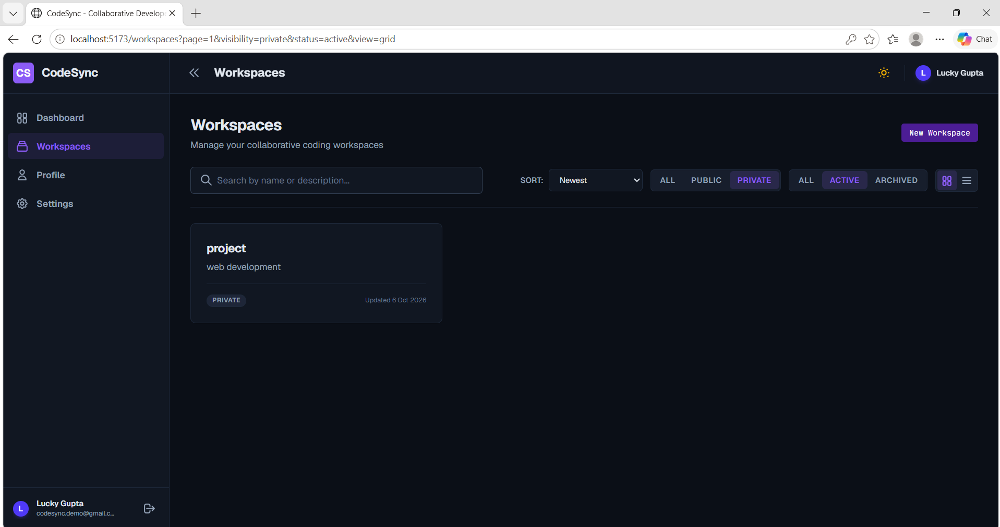
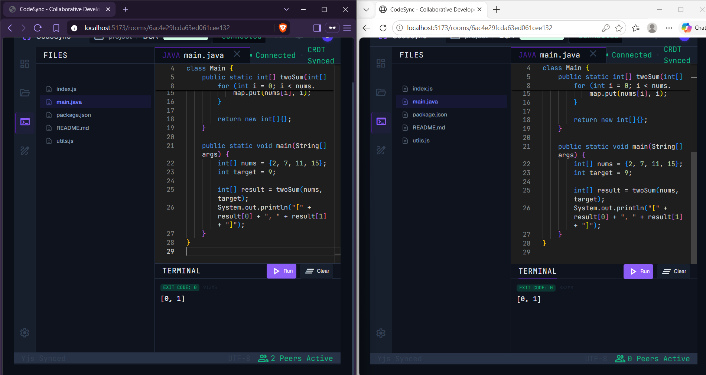
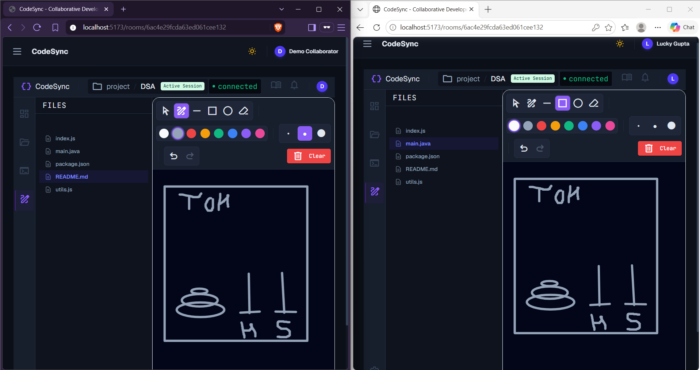
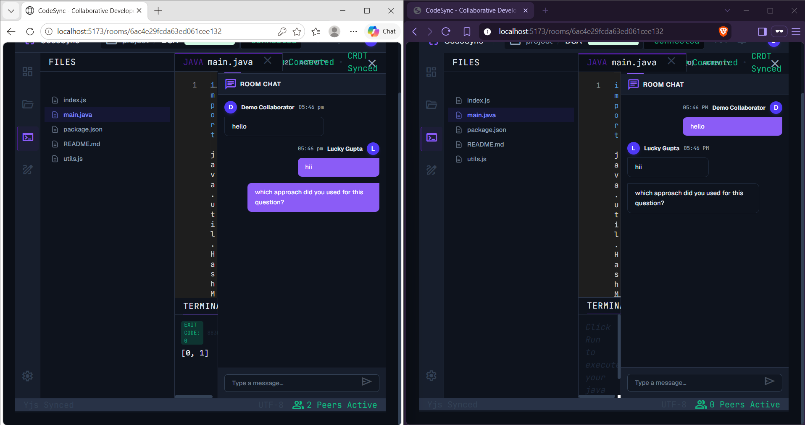

# CodeSync

CodeSync is a collaborative developer workspace where teams can edit code, draw diagrams, chat, execute code, and collaborate in real-time.

## Project Overview

CodeSync solves the challenge of distributed pair programming and technical interviews by providing a unified, real-time environment. Unlike traditional IDEs, CodeSync runs in the browser and synchronizes code edits, whiteboard diagrams, and chat messages instantly across multiple clients using Conflict-free Replicated Data Types (CRDTs) and WebSockets.

## Screenshots

### Workspace Management


_Manage public and private workspaces, view active rooms, and control role-based access._

### Real-Time Code Collaboration


_Live multiplayer code editing using Monaco Editor and Yjs CRDTs for seamless synchronization._

### Integrated Whiteboard


_Built-in collaborative whiteboard for architectural diagramming and system design discussions._

### Live Chat & Membership


_Real-time workspace chat and participant presence tracking powered by Socket.IO._

## Key Features

- **Secure Authentication**: Argon2 password hashing and JWT-based session management.
- **Role-Based Access Control**: Granular permissions (Owner, Admin, Editor, Viewer) for workspaces.
- **Real-Time Collaboration**: Instant synchronization of code and cursors using Yjs and WebSockets.
- **Code Execution**: Support for compiling and running multiple programming languages.
- **Collaborative Whiteboard**: Shared drawing canvas for system design.
- **Live Chat**: Integrated messaging system for active workspace members.

## Technology Stack

- **Monorepo**: Turborepo, npm workspaces
- **Frontend**: React 19, TypeScript, Vite, Tailwind CSS v4, React Router, TanStack Query, Zustand, Monaco Editor, React Hook Form, Zod
- **Backend**: Express.js, TypeScript, MongoDB, Mongoose, Socket.IO, Yjs, Helmet, Rate Limiter
- **Testing**: Vitest, React Testing Library, Jest, Supertest
- **Infrastructure**: Docker, Docker Compose, GitHub Actions, Husky, lint-staged

## System Architecture

CodeSync uses a decoupled client-server architecture within a Turborepo monorepo. The React frontend communicates with the Express backend via RESTful APIs for persistence and standard operations (authentication, workspace management). Real-time features (code editing, chat, whiteboard) operate over a persistent Socket.IO WebSocket connection. MongoDB is used as the primary database for users, workspaces, rooms, and chat histories.

## Real-Time Collaboration Workflow

Collaboration is powered by a hybrid approach:

1. **CRDTs for Code**: Code editing leverages `Yjs` and `y-monaco` to resolve concurrent edits deterministically without a central authority resolving conflicts.
2. **WebSockets for Transport**: The backend utilizes Socket.IO to broadcast Yjs update vectors, cursor positions, whiteboard state changes, and chat messages to all connected clients in a specific room.

## Project Structure

```text
CodeSync/
├── apps/
│   ├── api/          # Express + TypeScript Backend
│   └── web/          # React + Vite + Tailwind Frontend
├── packages/
│   ├── config/       # Global configuration constants
│   ├── types/        # Shared TypeScript interfaces & types
│   ├── ui/           # Shared React UI component library
│   ├── utils/        # Shared utility functions
│   └── validators/   # Shared Zod validation schemas
├── docs/
│   └── screenshots/  # Project demonstration images
└── docker-compose.yml# Multi-container local orchestration
```

## Prerequisites

- Node.js >= 22.20.0
- npm >= 10.9.3
- MongoDB (Running locally or via Docker Compose)
- Docker & Docker Compose (Optional, for containerized deployment)

## Installation and Local Setup

1. Clone the repository and install dependencies from the root:

   ```bash
   npm install
   ```

2. Copy the environment variables:

   ```bash
   cp apps/api/.env.example apps/api/.env
   cp apps/web/.env.example apps/web/.env
   ```

3. Ensure MongoDB is running locally on port `27017` or use the provided Docker setup.

## Environment Variable Configuration

### Backend (`apps/api/.env`)

```env
PORT=5000
NODE_ENV=development
MONGO_URI=mongodb://localhost:27017/codesync
CORS_ORIGIN=http://localhost:5173
JWT_ACCESS_SECRET=your_super_secret_access_key
JWT_ACCESS_EXPIRES_IN=15m
JWT_REFRESH_SECRET=your_super_secret_refresh_key
```

_(Do not use default or empty secrets in production)_

## Running the Application

### Using npm scripts

Start the development servers (runs both API and Web simultaneously):

```bash
npm run dev
```

The frontend will be available at `http://localhost:5173` and the backend at `http://localhost:5000`.

### Using Docker Compose

To spin up the entire application stack including the MongoDB database:

```bash
docker compose up --build -d
```

## Available Scripts

From the repository root, you can run:

- `npm run dev`: Start development servers.
- `npm run build`: Build all applications and packages.
- `npm run lint`: Lint all files using ESLint.
- `npm run format`: Format the codebase using Prettier.
- `npm run test`: Run all test suites across the monorepo.

## Supported Programming Languages

The code execution environment currently supports the following languages:

- JavaScript (`javascript`)
- TypeScript (`typescript`)
- Python (`python`)
- Java (`java`)
- C++ (`cpp`)
- C (`c`)
- Go (`go`)
- Rust (`rust`)

## Security Considerations & Current Limitations

- **Authentication**: JWT secrets must be securely generated and injected via environment variables. Passwords are securely hashed using Argon2.
- **Rate Limiting**: API endpoints are protected by an IP-based rate limiter (default: 100 requests per 15 minutes), ensuring protection against brute-force attacks.
- **Limitations**: Code execution currently runs locally/within the backend environment. In a production environment, code execution must be sandboxed (e.g., using isolated Docker containers or Firecracker microVMs) to prevent arbitrary remote code execution (RCE) vulnerabilities.

## Future Improvements

- Fully sandboxed remote code execution for untrusted code.
- Persistent storage of Yjs document states in MongoDB for offline recovery.
- Advanced WebRTC integration for voice and video communication during pair programming.

## License

This project is licensed under the MIT License - see the [LICENSE](LICENSE) file for details.
